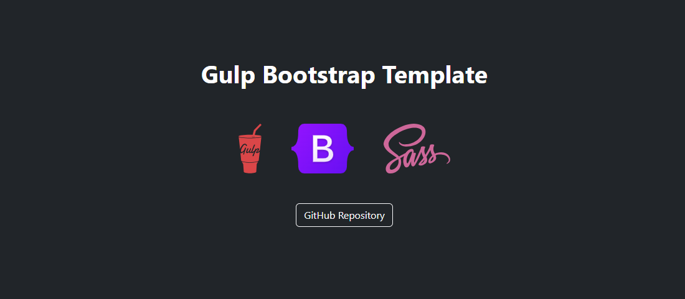

# Gulp Bootstrap Template


A customizable template built with **Gulp**, **Bootstrap 5**, and **Sass**. Perfect for web development workflow with live reloading, optimized assets, and production-ready builds.

## Features

- **Development Workflow**: Live reloading with BrowserSync for real-time updates.
- **Production Build**: Minified CSS and JS, optimized images, and processed HTML.
- **Sass Integration**: Easily customize Bootstrap or add your own styles.
- **Bootstrap 5**: Pre-integrated with the latest version of Bootstrap.
- **Modular Gulp Tasks**: Separate tasks for development and production.

## Preview

  

## Prerequisites

Before you begin, ensure you have the following installed:
- [Node.js](https://nodejs.org/) (version 16.x or higher recommended)
- [npm](https://www.npmjs.com/) (comes with Node.js)
- [Git](https://git-scm.com/) (optional, for cloning the repo)

## Installation

1. **Clone the repository**:
   ```bash
   git clone https://github.com/daddriel/gulp-bootstrap-template.git
   cd gulp-bootstrap-template
   ```
2. **Install dependencies**:
   ```bash
   npm install
   ```
3. **Run the development server**:
   ```bash
   gulp serve
   ```
4. **Build for production**:
   ```bash
   gulp
   ```

## Technologies Used

- Gulp - Task runner

- Bootstrap 5 - CSS framework

- Sass - CSS preprocessor

- BrowserSync - Live reloading

## License
This project is licensed under the MIT License (LICENSE).

